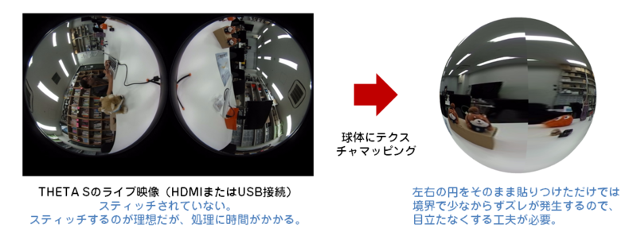
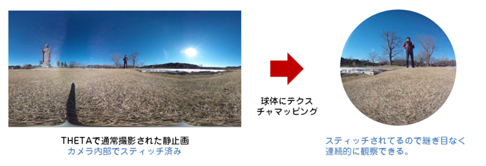

= RICOH THETA Developer Community Guide
The RICOH THETA 360 Developer Community

A collection of tips to unlock
a new world of 360 degree images and videos.

Helping novice to intermediate
developers to use the RICOH THETA S API to control
the camera. Includes community information
on the basics of using the media.

== Official Information

* https://developers.theta360.com/en/docs/v2/api_reference/[RICOH THETA API v2],
compliant with
https://developers.google.com/streetview/open-spherical-camera/[Open Spherical Camera API version 1.0] from Google.
* https://developers.theta360.com/en/forums/[THETA Developers Official Forum]
* https://developers.theta360.com/en/docs/sdk/[Official SDK]
* https://theta360.com/en/support/download/[Windows, Mac, iOS, Android apps]

== 360 Video Live Streaming
The THETA S can stream video when connected to a USB or HDMI cable.
The output is in dual fish-eye mode (two spheres). To make the video
usable in a web browser or with exernal services such as YouTube,
you'll need to convert the video into equirectangular mode. To view it with
360 degree navigation, you'll need to stitch it.

Community Contribution from Sunao Hashimoto, kougaku on GitHub. Full
sample source code is available.

* https://github.com/theta360developers/THETA-S-LiveViewer-P5[THETA S LiveViewer P5]

image::img/theta_s_live_viewer.gif[title="Live viewer for THETA S"]

The example above is built with https://processing.org/[Processing].

Additional information is on his http://d.hatena.ne.jp/kougaku-navi/[blog post in Japanese].

The developer below, Goroman, was able to get reasonable 360 video live streaming in equirectangular mode
after an hour of work back in September, 2015. Additional information in
http://tips.hecomi.com/entry/2015/10/11/211456[Japanese is here]. 

image::img/goro_man.png[title="equirectangular video without stitching" link="https://youtu.be/edWrhCYIS5Q"]

Once the video is streamed in equirectangular mode, viewers such as VR Gear
or a browser using YouTube 360 can stitch the image.

== THETA Shader Pack for Unity to Convert Media into Equirectangular Format
Nora, @steroarts, released a shader pack to convert THETA 360 degree
media into equirectangular format in real time. 

* https://dl.dropboxusercontent.com/u/7131835/Programs/ThetaS_LiveView_Sample.unitypackage[Shader Pack]

== Panorama Viewer for Still Images

https://github.com/kougaku/PanoramaViewer[Source code available on GitHub].

== Lens Parameter Information
The lens geometry for the THETA is based on equidistant projection.
The final projection
style for both videos and images is equirectangular projection.
RICOH does not make detailed lens parameter information available. This is
also known as lens distortion data. Developers often ask for this
information to improve stitching. It is proprietary and not available
as of December 2015. Stitching is still possible without this information.

