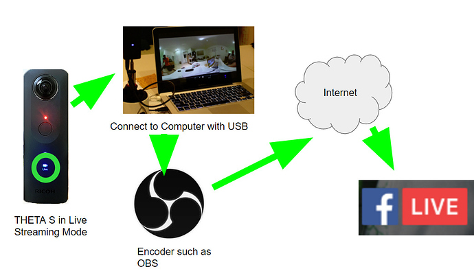
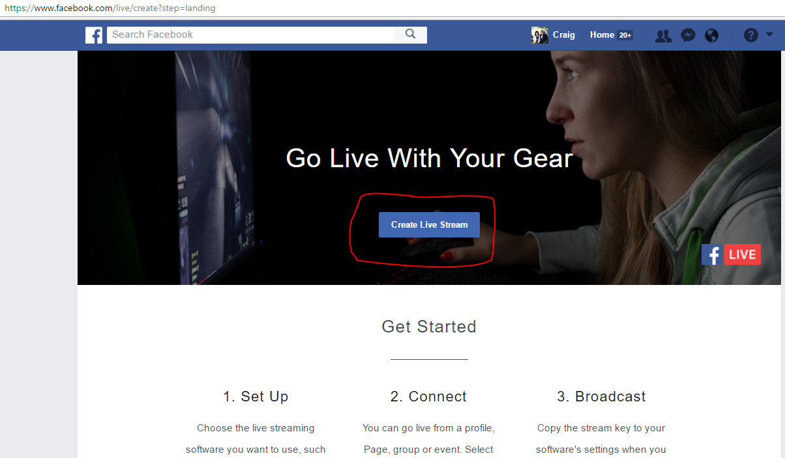
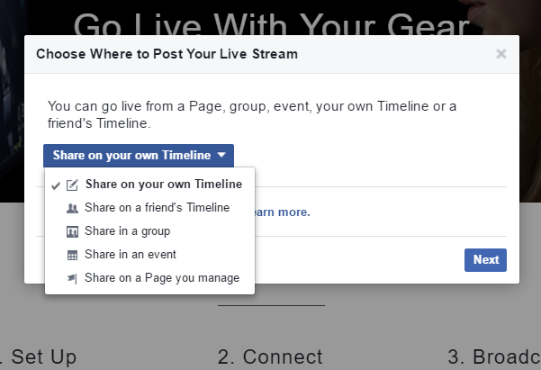
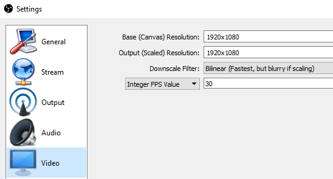
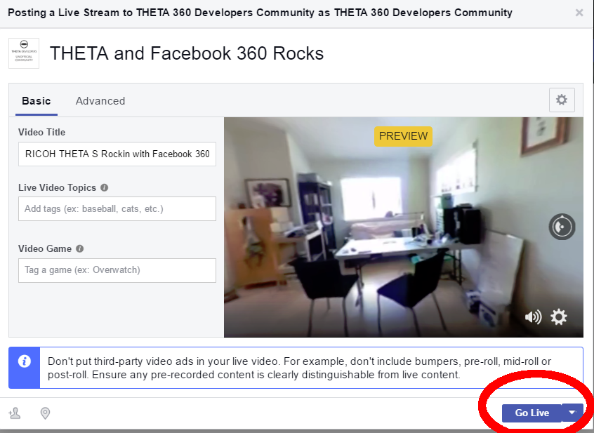
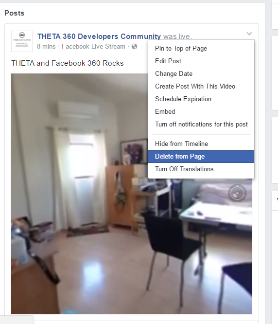

## Facebook Live 360&#176; Event
We are working on a separate guide for Facebook Live 360 with RICOH THETA S. See http://lists.theta360.guide[unoffical forum]
for updates.

**What We're Doing**

We're using a RICOH THETA S to live stream 360 events to Facebook Live 360. The live 360 events can be viewed in VR headsets, on a mobile phone, or in a web browser.

**What You Need**

* RICOH THETA S in live streaming mode
* Mac or PC connected to the THETA S with a USB cable
* THETA UVC FullHD Blender software from RICOH. Called Live-streaming app on their site. https://theta360.com/en/support/download/[download]
* https://obsproject.com/[OBS] or equivalent encoding software
* Internet access with good upstream bandwidth
* Facebook Live 360

**Process**

1. Set up UVC FullHD Blender. We're assuming that you have the THETA working with THETA UVC FullHD Blender in live streaming mode. If you do not, refer to the [live streaming guide](http://theta360.guide/community-document/live-streaming.html) for detailed instruction.
2. Set up Facebook Live 360
3. Configure OBS with information from Facebook Live 360  event
4. Stream from OBS to Facebook Live
5. From FB Live, stream the event to your audience

**Configure Facebook Live**

http://fb.com/live/create[fb.com/live/create]

**Click on Create Live Stream**

**Select Location to Post**

Show on your own timeline, a group, create an event, or broadcast to a page you manage.

**Select 360 video**

Make sure you check, *This live stream is a 360 video*

image::img/livestreaming/facebook/live-stream-360.png[role="thumb" title="The checkbox for 360 video needs to be selected"]

**Get Streaming Information**

On Facebook, get the *Server URL* and *Stream Key*

image::img/livestreaming/facebook/stream-key.png[role="thumb" title="Copy the information above for the OBS stream configuration"]

**Configure OBS**

**Create Source**

image::img/livestreaming/facebook/create-source.png[role="thumb" title="Source can be any name that is meaningful to you"]

**Configuration Overview**

* Target Resolution: 1080p at 2:1 aspect ratio (1920x960) • Frame Rate: 30fps
* Target bitrate: 4 Mbps (megabits)
* Keyframe frequency: 1 I-frame every 2 seconds (minimum) • Audio: AAC
* Audio Sample Rate: 44.1 KHz
* Audio Bitrate: 128 Kbps (kilobits)

**Configure Video**

* Device: THETA UVC FullHD Blender
* Resolution: 1920x1080 (if using driver above)
* FPS: Match Output FPS (which is 30 fps)

image::img/livestreaming/facebook/obs-video-config.png[role="thumb" title="OBS video configuration"]

**OBS Settings**

Under *Settings -> Stream*

image::img/livestreaming/facebook/obs-stream-config.png[role="thumb" title="Get this info from Facebook Live 360 config"]

*Settings -> Video*

**Preview Live Stream on OBS**

image::img/livestreaming/facebook/obs-preview.jpg[role="thumb" title="OBS preview is in equirectangular"]

If you don't see an equirectangular stream that is similar to image above, go to the <<troubleshooting>> section.

**Start Stream on OBS**

image::img/livestreaming/facebook/obs-start-stream.png[role="thumb" title="start the stream on OBS and send to Facebook Live 360 server"]

**Go Live 360 Broadcast on Facebook**

**View Live on Facebook**

image::img/livestreaming/facebook/page-sample.png[role="thumb" title="RICOH THETA S Live 360 Event on Facebook Page"]

// image::img/livestreaming/facebook/fb-live-event.png[role="thumb" title="Your audience can now view a live 360 event on your page or timeline"]

**Automatically Promote Saved Event on Facebook Timeline**

image::img/livestreaming/facebook/saved-event.png[role="thumb" title="Promote your saved event on your page or timeline"]

**Adjust Sharing, Expiration or Delete**

