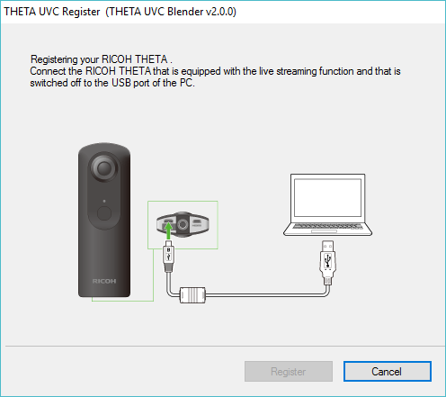
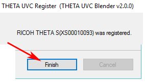

= RICOH THETA Live Streaming
:icons: font
:toc: right
:toclevels: 2
:toc-title: Contents
:sectnums:

++++

++++
image::img/livestreaming/doc-banner.png[role="thumb"]

== Enable Live Streaming Mode
With the THETA off, press and hold the _mode_ button. Keep pressing mode
and then press _power_. The camera will go into live streaming mode.

image::img/livestreaming/mode-buttons.png[role="thumb" title="Start THETA in LiveStreaming mode"]

With the camera in live streaming mode, the word _Live_ will appear in blue.

image::img/livestreaming/live-light.png[role="thumb" title="Verify that the camera's _Live_ light is on"]

== Connect Camera to Computer
Plug the camera into your computer with a micro USB cable. It will appear as a normal
webcam. The camera will be called _RICOH THETA S_.

image::img/livestreaming/skype-webcam.png[role="thumb" title="Confirm you can see _RICOH THETA S_ as a webcam"]

The THETA is now streaming in dual-fisheye mode. The stream is 1280x720 at 15fps.
The data is in MotionJPEG format.

== Install Live Streaming Software
To stream the video to YouTube, install the official
https://theta360.com/en/support/download/[RICOH Live-streaming app] and
https://obsproject.com/[OBS].

NOTE: Many software can be used to stream to YouTube. Refer to
https://support.google.com/youtube/answer/2907883?hl=en[YouTube Live Verified Devices and Software]
for more information.

=== https://theta360.com/en/support/download/[Download and Install RICOH Live-Streaming App]

image::img/livestreaming/live-streaming-download.png[role="thumb" title="Download the RICOH Live-Streaming App"]

1. Select Windows 32bit, Windows 64bit, or Mac
2. Turn your THETA off
3. Unplug THETA from your computer
4. Install software

image::img/livestreaming/uvcblender-install.png[role="thumb" title="Live-Streaming App File is Called UVC Blender"]

With the THETA turned off, the software will prompt you to reconnect the THETA to register your camera.

After you connect your THETA, a _Register_ button will appear.

image::img/livestreaming/register-button.png[role="thumb" title="Register buttons appears after connection"]

Complete the registration.

Test the THETA UVC Blender driver with any software that works with a webcam. In the example
below, I am using Skype.

image::img/livestreaming/theta-uvc-skype-select.png[role="thumb" title="Testing THETA UVC Blender with Skype"]

CAUTION: Make sure you select _THETA UVC Blender_ and not _RICOH THETA S_.

NOTE: In Skype, the video does not have 360 navigation (as of Oct 2016) and it will
look like a distorted rectangle. Skype is for testing only, not for use.

=== https://obsproject.com/[Download and Install OBS]
image::img/livestreaming/obs-icon.png[role="thumb" title="OBS-Studio"]
