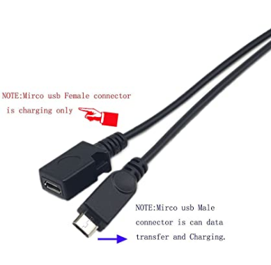

= RICOH THETA Live Streaming
:icons: font
:toc: right
:toclevels: 2
:toc-title: Contents
:sectnums:

++++

++++

== Camera Models

.Table Live Streaming Cameras
|===
|Model |Streaming Supported |Stitching |Resolution | Output Connection

|THETA Z1
| Yes
| Internal 
| 3840x1920 @ 30fps
| Wi-Fi, Ethernet,  USB - icon:puzzle-piece[]

|THETA V
| Yes
| Internal 
| 3840x1920 @ 30fps
| Wi-Fi, Ethernet,  USB - icon:puzzle-piece[]

|THETA S
|Yes
|External
|1920x1080 @ 30fps
| USB, HDMI

|RICOH R Dev Kit
|Yes
|Internal
|1920x1080 @ 30fps
| USB, HDMI

|THETA SC2
|No
|Not supported
|N/A
|N/A

|THETA SC
|No
|Not supported
|N/A
|N/A

|===

NOTE: icon:puzzle-piece[3x] Streaming the THETA V through a Wi-Fi router or mobile hotspot requires the Wireless Live Streaming plug-in, a free download from the THETA Store.

CAUTION: THETA V and Z1 Ethernet connection
requires a USB OTG Ethernet adapter plugged into the USB port. The THETA V will not charge while using Ethernet. The battery will drain. Community members have 
https://community.theta360.guide/t/how-to-connect-theta-v-with-ethernet/3298/31?u=craig[reported success] 
using a splitter to stream with Ethernet while powering the THETA V. 

NOTE: The RICOH R Dev Kit supports internal stitching for both USB and HDMI. The video
quality is 1920 x 960 with actual size output of 1920  x 960 + 120. 

== RICOH THETA V Software 

=== THETA V Streaming with Wi-Fi - icon:puzzle-piece[2x]

You can stream the THETA V through a Wi-Fi router or a mobile phone used as a hotspot. 
https://pluginstore.theta360.com/plugins/com.theta360.cloudstreaming/[Wireless Live Streaming] plug-in. A step-by-step guide is available 
http://theta360.guide/wireless-plugin-guide/[here].

The plug-in is free to install. 
https://github.com/ricohapi/theta-wireless-live-streaming-plugin[Source code is also available] if you wish to modify the
plug-in or build your own streaming application.

The Wireless Live Streaming Guide shows how to configure that THETA V using
a browser-based configuration tool. You will need to enter the YouTube streaming server
URL and the Stream key.

image::img/livestreaming/thetav/streaming-server.png[role="thumb" title="Wireless Configuration"]

=== THETA V Streaming with Ethernet - icon:puzzle-piece[2x]

You can stream the THETA V using Ethernet using a USB OTG adapter.  See 
https://community.theta360.guide/t/how-to-connect-theta-v-with-ethernet/3298?u=codetricity[this] article
for more information. Not all USB OTG Ethernet adapters will work. In most cases, the camera does not charge
while you are connected with Ethernet. 

Community member Kev091190 has reported success using an USB splitter with the 
THETA V.

A picture of his cable setup is shown below.

Kevin is using the SinLoon 30cm USB 2.0 Data Charge Y Splitter Cable.

image::img/livestreaming/ethernet/sinloon-y-splitter-2.png[role="thumb" title="Sinloon y-Splitter full cable layout"]

It's also theoretically possible to 
https://community.theta360.guide/t/possible-theta-v-battery-bypass-hack-untested/3372?u=codetricity[bypass the battery], though
there have been no supported successed. 

=== THETA V and Z1 Streaming with a USB Cable
If you are streaming the THETA V or THETA Z1 over a USB cable, you must select a THETA V or THETA Z1 video device on your Mac computer when you use an encoding software such as 
https://obsproject.com/[OBS Studio]. On Windows, you can stream directly using https://mpc-hc.org/[MPC-HC] or download the THETA V/Z1 live streaming
driver.  This setup will allow you to stream to YouTube
or Facebook.

==== THETA V/Z1 live streaming OS requirements

* Windows 10 version 1703 or later
* macOS Sierra version 10.12.4 or later.

==== THETA V/Z1 Windows drivers

As of July 7, 2020, the latest Windows 10 driver is version 2.0.

The latest driver is available at 
https://livestreaming.theta360.guide[https://livestreaming.theta360.guide]

==== THETA V/Z1 driver for macOS

The driver is installed automatically when you connect the camera. 
Select RICOH THETA V/Z1 in OBS or the encoder software you want to use.

==== Encoder Software

Example using OBS.

image::img/livestreaming/thetav/obs.jpg[role="thumb" title="OBS settings"]

== THETA V audio
As of September 2018, spatial audio does not work in streaming mode. You can stream single
channel audio. Windows computers need build 1709 or later.

If you have trouble with single channel audio, make sure that you have selected RICOH THETA V as the
default microphone when you are streaming.

image::img/livestreaming/thetav/microphone.png[role="thumb" title="RICOH THETA V Microphone"]

The audio should be set up automatically. The following screenshot is for troubleshooting. 
You should not need to set this.

image::img/livestreaming/thetav/audio-properties.png[role="thumb" title="Microphone Properties"]

== RICOH THETA S Software Video Devices
On your Mac or Windows computer, you have three options for THETA webcam devices: RICOH THETA S,
THETA UVC HD Blender,  THETA UV FullHD Blender. You're probably wondering what the differences
are between the three webcam devices. As of
July 2017, this is my understanding of the differences. This is based on the
https://developers.theta360.com/en/docs/introduction/[official RICOH specifications]. RICOH R Development
Kit information was taken from their
http://ricohr.ricoh/en/[main site].  If this
table is in error, please add to the discussion http://lists.theta360.guide/t/360-live-streaming-guide-for-ricoh-theta/621[here].

.Table THETA S Live Streaming Drivers
|===
|Driver |Display Format |Image Size and FPS | Streaming Format | USB Standard

|THETA S |dual-fisheye | 1280x720 @ 15fps | MotionJPEG | UVC 1.1

|THETA S |dual-fisheye | 1920x1080 @ 30fps with firmware 01.82 | H.264 |UVC 1.5

|THETA UVC HD Blender | Equirectangular | 1280x720 @ 15fps | MotionJPEG | UVC 1.1

|THETA UVC FullHD Blender | Equirectangular |1920x1080 @ 30fps with firmware 01.82 | H.264 | UVC 1.5

|RICOH R Development Kit UVC Capture | Equirectangular | 1920x960+120 @ 29.97fps | H.264 | UVC 1.5

|===

NOTE: Despite different specifications for the RICOH R and THETA UVC FullHD Blender drivers,
I believe that the resolution and fps are the same.

== THETA V Live Streaming Mode

If you are streaming over USB, cycle through the image, video, and live modes by pressing 
and releasing the lower mode button on the side of the camera.

== THETA S Live Streaming Mode
With the THETA off, press and hold the _mode_ button. Keep pressing mode
and then press _power_. The camera will go into live streaming mode.

image::img/livestreaming/mode-buttons.png[role="thumb" title="Start THETA in LiveStreaming mode"]

With the camera in live streaming mode, the word _Live_ will appear in blue.

image::img/livestreaming/live-light.png[role="thumb" title="Verify that the camera's _Live_ light is on"]

=== Connect Camera to Computer
Plug the camera into your computer with a micro USB cable. It will appear as a normal
webcam. The camera will be called _RICOH THETA S_ or  _RICOH THETA V_.

image::img/livestreaming/skype-webcam.png[role="thumb" title="Confirm you can see _RICOH THETA S_ as a webcam"]

The THETA S will stream in dual-fisheye mode. If you're using firmware 01.82 or above,
the stream is 1920x1080 at 30fps using H.264. Earlier firmware will produce a 1280x720  stream at 15fps

The THETA V will stream in equirectangular mode.

=== Install Live Streaming Software
To stream the video to YouTube, install the official
https://theta360.com/en/support/download/[RICOH Live-streaming app] and
https://obsproject.com/[OBS].

NOTE: Many software can be used to stream to YouTube. Refer to
https://support.google.com/youtube/answer/2907883?hl=en[YouTube Live Verified Devices and Software]
for more information.

==== Download and Install RICOH Live-Streaming App

If you are using a RICOH THETA V, see https://community.theta360.guide/t/howto-ricoh-theta-v-4k-live-streaming-with-uvc-4k-driver-for-windows-10/1647?u=codetricity[this] document.

https://theta360.com/en/support/download/[Download]

image::img/livestreaming/live-streaming-download.png[role="thumb" title="Download the RICOH Live-Streaming App"]

1. Select Windows 32bit, Windows 64bit, or Mac
2. Turn your THETA off
3. Unplug THETA from your computer
4. Install software

image::img/livestreaming/uvcblender-install.png[role="thumb" title="Live-Streaming App File is Called UVC Blender"]

With the THETA turned off, the software will prompt you to reconnect the THETA to register your camera.

image::img/livestreaming/register.png[role="thumb" title="Register THETA with computer"]

NOTE: RICOH updated UVCBlender to 2.0.0 on November 24, 2016. https://theta360.com/en/info/news/2016-11-24-1/[Official announcement].
This was a significant upgrade that enabled full HD at 30 fps with USB. It also moved to USB Video Class (UVC) 1.5.
See http://www.usb.org/developers/docs/devclass_docs/[USB device class specifications].

After you connect your THETA, a _Register_ button will appear.

image::img/livestreaming/register-button.png[role="thumb" title="Register buttons appears after connection"]

Complete the registration.

image::img/livestreaming/registration-complete.png[role="thumb" title="Camera and computer registration complete"]

Test the THETA UVC FullHD Blender driver with any software that works with a webcam. In the example
below, I am using Skype.

image::img/livestreaming/skype-test.png[role="thumb" title="Testing THETA UVC FullHD Blender with Skype"]

NOTE: In Skype, the video does not have 360&#176; navigation (as of Jan 2017) and it will
look like a distorted rectangle. Skype is for testing only, not for use.

You can also test it with other software such as OBS if you already have it installed.

image::img/livestreaming/webcam-options.png[role="thumb" title="Testing THETA UVC FullHD Blender with OBS"]

CAUTION: Make sure you select _THETA UVC FullHD Blender_ and not _RICOH THETA S_.

== RICOH R Development Kit

This section refers to the
http://ricohr.ricoh/en/[RICOH R Development Kit]. If you have a THETA S,
ignore this section.

The RICOH R Development Kit boots into HDMI out mode when you power it on.
To use the unit on your desktop, you need to change it from HDMI mode to USB
output mode.

=== Set to USB out
If the top LED on the side is blue, change it to green by pressing the bottom button.
Each press should be 1 second.

image::img/livestreaming/ricohr/mode-image.jpg[role="thumb" title="Set the mode to USB. Green LED is displayed."]

image::img/livestreaming/ricohr/green.jpg[role="thumb" title="Green LED indicates USB output."]

=== Install USB Driver

You only need this software for USB live streaming with the RICOH R Dev Kit. If you are using HDMI or have a
THETA S, you can skip this section. Download the
https://github.com/ricohr/ricoh-r-dk-uvc-capture/releases/tag/%EF%BD%961.0.0[ricoh-r-dk-uvc-capture]
application from GitHub.

image::img/livestreaming/ricohr/github.png[role="thumb" title="RICOH R Dev Kit USB driver on GitHub"]

CAUTION: Make sure you select _RICOH R Development Kit UVC Capture_ and not _RICOH R Development Kit_.

image::img/livestreaming/ricohr/correctdriver.jpg[role="thumb" title="OBS Studio with the RICOH R  USB Driver"]

If you select the wrong driver, you will not get a video stream.

image::img/livestreaming/ricohr/incorrectdriver.png[role="thumb" title="This is the wrong RICOH R  USB Driver for OBS"]

== Configure Computer To Stream to Internet

Download and install OBS.

image::img/livestreaming/obs-icon.png[role="thumb" title="OBS Studio"]

https://obsproject.com/[Download OBS]

Create a new _Scene_. Any name is fine. Click on the plus sign. Under
_Sources_, add THETA Full HD UVC Blender (any name is fine) and add
a video capture device. Right click to open the pop-up menu.

image::img/livestreaming/obs-video-capture.png[role="thumb" title="Add Video Capture Device to OBS _Sources_"]

Select _THETA UVC Blender_ as the Device. Verify that the video stream is in equirectangular format.

image::img/livestreaming/obs-device.png[role="thumb" title="Verify THETA UVC Blender works in OBS"]

If you see this message, the camera is not connected properly. Go to the troubleshooting section or read the tip
below.
image::img/livestreaming/error-message.png[role="thumb" title="Error message when camera not detected"]

TIP: If you see a black screen that says _Status:0x800705AA_, try to toggle your device between your two
webcams. If you still see the error, disconnect all other webcams or disable the webcam on your laptop
and then reboot your computer. The error above indicates that a connection is not established. See Troubleshooting
section below

Leave the Resolution/FPS Type as _Device Default_.

image::img/livestreaming/resolution-fps.png[role="thumb" title="Leave Resolution/FPS Type as Default"]

Under Settings -> Video, set the resolution to 1920x1080 at 29.97fps (30fps will also work).

image::img/livestreaming/obs-settings-video.png[role="thumb" title="Configure Resolution to 1920x1080"]

NOTE: In November of 2016, the maximum resolution for UVC Blender got upgraded to 1080p from 720.
You need the latest driver and firmware to achieve the higher resolution.

Select Stretch to screen.

image::img/livestreaming/obs-stretch-to-screen.png[role="thumb"]

## Create a YouTube Live 360&#176; Event

Log into YouTube. Click on the _Upload_ button.
Click the _Get started_ button on live streaming.

image::img/livestreaming/youtube-livestream.png[role="thumb" title="Click Live Streaming after you click upload"]

Select _Events_.

image::img/livestreaming/youtube-event.png[role="thumb" title="Select Events"]

WARNING: Make sure you select Events. You will not get a 360&#176; stream with _Stream now_.

In the right side of the screen, select _New live event_.

image::img/livestreaming/youtube-new-live-event.png[role="thumb" title="New live event"]

Add a title.

Select Advanced Settings

image::img/livestreaming/youtube-advanced-settings.png[role="thumb"]

Select _This live stream is 360_.

image::img/livestreaming/youtube-livestream360.png[role="thumb" title="Select _This live stream is 360_"]

Create the event. On the next screen, grab stream name from _Ingestion Settings_

image::img/livestreaming/youtube-ingestion-1.png[role="thumb"]

Once you click on _Basic ingestion_ information on your encoder will open up. Set your bandwidth to the
highest value your network can support. In the example below, I have it set to 720p as I have only
1.5Mbps upstream at my house.

image::img/livestreaming/youtube-basic-ingestion.png[role="thumb"]

Copy the stream name. You will need this for OBS. In OBS, it is called, _Stream key_.

image::img/livestreaming/youtube-streamname.png[role="thumb"]

Open OBS, go to Settings -> Stream. Paste the YouTube stream name into the box
on OBS called, _Stream key_.

image::img/livestreaming/obs-streamkey.png[role="thumb"]

On the main OBS front control panel, press _Start Streaming_ in the right hand
side of the control panel.

image::img/livestreaming/obs-start-streaming.png[role="thumb"]

On YouTube, go to the _Live Control Room_ and click _Preview Stream_.

image::img/livestreaming/youtube-preview.png[role="thumb"]

You can preview the stream if you have good bandwidth. I have limited
upstream bandwidth in my office. I reduced the ingestion bandwidth,
making my resolution lower. Navigation in 360 works fine. My resolution
is limited by my 1.5Mbps upload bandwidth.

image::img/livestreaming/youtube-preview-test.png[role="thumb"]

When you're ready, start the stream.

image::img/livestreaming/youtube-streaming.png[role="thumb"]

This is an example of the THETA S streamed to YouTube with faster bandwidth.

This is a screenshot from the live stream of the RICOH R Development Kit from their
demo at CES in January of 2017.

The RICOH R Dev Kit was plugged into
http://static-shell.cerevo.com/en/index.html[LiveShell] at the event.
For information on using HDMI output to stream with a Teradek VidiU, which is
similar to LiveShell, read the article
http://lists.theta360.guide/t/youtube-360-live-streaming-with-the-ricoh-r-dev-kit-and-teradek-vidiu/1419[YouTube 360 Live Streaming with the RICOH R Dev Kit and Teradek VidiU]

// Facebook Section
include::facebook.adoc[]

## Using HDMI

Using USB output for live streaming, you will get a maximum resolution of 1080p.
This is the same resolution as saving video files to your camera.
If you save still images as timelapse, you can get 5376x2688, which will be displayed
as 4K on YouTube.

The THETA S has an HDMI port that can output 1920x1080 at 30fps. Until
November 2016, this resolution was higher than the USB port. People were using
the HDMI to get higher resolution.

In order to use
this signal, you need to use something like
https://www.blackmagicdesign.com/products/ultrastudiothunderbolt[Blackmagicdesign UltraStudio for Thunderbolt].

Once you get the video stream onto your computer, it will be in dual-fisheye.
Although I have not tested it, you can may be able to use THETA UVC FullHD Blender to
get this into equirectangular. With the previous driver, this was definitely not possible.
If you test it and get it to work, let me know.

It's possible to use the RICOH R Development Kit to output equirectangular
directly from HDMI and connect it to a device like VidiU (tested) or Blackmagic (not tested).
See this
http://lists.theta360.guide/t/youtube-360-live-streaming-with-the-ricoh-r-dev-kit-and-teradek-vidiu/1419[article]
for more information on the RICOH R Development Kit.

There are third-party products
such as
http://theta360.guide/showcase/ricoh-product-streambox.html[Streambox Cloud Encoder] or
MimoLive.

### Streambox

image::img/livestreaming/streambox-theta.png[role="thumb"]

This is the workflow.

image::img/livestreaming/streambox-workflow.png[role="thumb"]

This is a
https://www.youtube.com/watch?v=d8TN_Vc6wL0[sample of the live stream using a THETA].

image::img/livestreaming/streambox-sample.png[role="thumb"]

This is the equipment and service list used:

* Streamed live using Streambox Cloud Encoder
* RICOH THETA S Camera
* BlackMagic UltraStudio Mini Recorder
* MacBook Pro with USB Modems
* Streambox Cloud

### mimoLive
Boinx Software offers https://boinx.com/mimolive/[mimoLive].

They have a good video that provides an https://youtu.be/nNQES53S2jc[overview of their service]
specifically for the THETA S.

mimoLive can accept a USB or HDMI stream in dual-fisheye.

In order to use the HDMI output from the THETA, you will need a HDMI video grabber.
Boinx Software recommends the Blackmagic Design
https://www.blackmagicdesign.com/products/ultrastudiothunderbolt[UltraStudio] Mini Recorder for Thunderbolt or the
http://www.magewell.com/usb-capture-hdmi[Magewell USB Capture HDMI adapter for USB 3].

image::img/livestreaming/mimolive/hdmi-usb.png[role="thumb" title="Getting THETA S HDMI Output Into Your Computer"]

image::img/livestreaming/mimolive/dual-fisheye.png[role="thumb" title="mimoLive dual-fisheye before conversion to equirectangular"]

mimoLive can take the THETA S dual-fisheye video stream source and apply a filter convert it to equirectangular for
streaming to places like YouTube Live 360 events.

image::img/livestreaming/mimolive/sources-thetas.png[role="thumb" title="Preset configuration and filter for THETA S"]

image::img/livestreaming/mimolive/placerlive.png[role="thumb" title="Filter converts dual-fisheye stream to equirectangular"]

mimoLive provides sliders to adjust the sphere stitching. You'll only be able to get a _good enough_ stitch. The
edges of the spheres will not match perfectly.

image::img/livestreaming/mimolive/adjustment.png[role="thumb" title="Use sliders to adjust sphere edges"]

This is an example of the https://youtu.be/8CEB2_YQgkU[360 live stream]. The quality of the stitch
is good.

Even if you are using USB output, you still may want to use mimoLive instead of the free RICOH THETA
UVC Blender app to take advantage of mimoLive features to add text, Twitter, and slides into the
YouTube live streaming event.

image::img/livestreaming/mimolive/text-placement360.png[role="thumb" title="Place text into live stream to YouTube"]

image::img/livestreaming/mimolive/twitter.png[role="thumb" title="Insert Twitter into live stream to YouTube"]

image::img/livestreaming/mimolive/slides.png[role="thumb" title="Insert presentation slides into 360 live stream"]

You can also center your video stream.

image::img/livestreaming/mimolive/adjust-center.png[role="thumb" title="Center 360 live stream"]

https://youtu.be/8CEB2_YQgkU[Example Stream Archive]

### RICOH R Dev Kit

The RICOH R Dev Kit can output equirectangular streaming video in Full HD, 59.94i.
An overview of using the RICOH R Dev Kit with HDMI is available in
http://lists.theta360.guide/t/youtube-360-live-streaming-with-the-ricoh-r-dev-kit-and-teradek-vidiu/1419[this article].

### Other
http://shop.videostream360.com/vr-cams-equipment/360camera[Videostream360]
offers a service to use THETA at 1920x1080 with HDMI. They even sell the THETA on their site.

If you have a solution for HDMI 360&#176; streaming and you've verified that it
works with the THETA, please join the
http://theta360.guide/ecosystem/[THETA Ecosystem] and
http://lists.theta360.guide/c/theta-media/ecosystem-discussion[post]
information about it.

## Problems with VLC 3.0.0
VLC 3.0.0 is currently not released. As of July 21, 2017, nightly builds
will not play the THETA stream correctly. The stream is upside down and the color is
off.

image::img/livestreaming/vlc-nightly-build.png[Problems with VLC 3.0.0 nightly builds]

include::unity-tethered.adoc[]

## Untethered WiFi Streaming

Streaming from the THETA S using WiFi is primarily of interest to developers
and hobbyists.  If you have a THETA V, you can stream 4K video directly from the camera with Wi-Fi.
The THETA V can stream either equirectangular 4K video or dual-fisheye if you use the plug-in technology.

### Using Unity

The THETA S can live stream a 640x320 MotionJPEG at 10fps over WiFi.
This is intended to preview
a picture prior to taking the picture. It's not intended for headset navigation.
The community has built some solutions to stream this low-res, low fps video
to mobile phones, primarily using Unity.

This is a short Vine video of a
https://vine.co/v/eV9XDQBEujt[demo].

image::img/livestreaming/wifi-unity.png[role="thumb" title="360&#176; video stream using WiFi"]

Most developers have challenges processing the MotionJPEG stream.

Fortunately,
https://github.com/theta360developers/ThetaWifiStreaming[sample code]
 of a THETA S WiFi streaming demo with Unity was developed by community member
https://github.com/makoto-unity[Makoto Ito].
 I've translated the
 https://github.com/makoto-unity/ThetaWifiStreaming/blob/master/README.md[README]
to his code as well as a
http://noshipu.hateblo.jp/entry/2016/04/21/183439[related blog] written by
https://twitter.com/noshipu[@noshipu], CEO of
http://vird.co.jp/[ViRD, Inc] for his contribution.

#### About the RICOH THETA API

In order to use Wifi live streaming, you must use the `_getLivePreview` API.
https://developers.theta360.com/en/docs/v2.0/api_reference/commands/camera._get_live_preview.html[Official Reference]

> NOTE from Craig: This was replaced by
https://developers.theta360.com/en/docs/v2.1/api_reference/commands/camera.get_live_preview.html[getLivePreview]
in version 2.1 of the API. This blog by Noshipu-san refers to the 2.0 API, which is still supported by
the THETA S. Be aware of the differences in your code.

Unlike the other APIs, `_getLivePreview` is different because the data is in a stream and keeps going. You will not be able to get a WWW class to wait until the request is complete (maybe).

> NOTE from Craig: This is the major problem developers have when working with `getLivePreview`. As the data
> is a stream, you can't want for the data to end before running your next command. For example, it's
> different from downloading and displaying an image or video file because you know when the transfer is
> complete.

#### Processing Flow

##### Set the POST request to create a HttpWebRequest class

    string url = "Enter HTTP path of THETA here";
    var request = HttpWebRequest.Create (url);
    HttpWebResponse response = null;
    request.Method = "POST";
    request.Timeout = (int) (30 * 10000f); // to ensure  no timeout
    request.ContentType = "application/json; charset = utf-8";

    byte [] postBytes = Encoding.Default.GetBytes ( "Put the JSON data here");
    request.ContentLength = postBytes.Length;

##### Generate a class of BinaryReader to get the byte data (you get the bytes one by one)

    // The start of transmission of the post data
    Stream reqStream = request.GetRequestStream ();
    reqStream.Write (postBytes, 0, postBytes.Length) ;
    reqStream.Close ();
    stream = request.GetResponse () .GetResponseStream ();

    BinaryReader reader = new BinaryReader (new BufferedStream (stream), new System.Text.ASCIIEncoding ());

##### Get the start and stop bytes of 1 frame of the MotionJPEG and cut out one frame

With the byte, check the partion value of the MotionJPEG.

    ...(http)
    0xFF 0xD8      --|
    [jpeg data]      |--1 frame of MotionJPEG
    0xFF 0xD9      --|
    ...(http)
    0xFF 0xD8      --|
    [jpeg data]      |--1 frame of MotionJPEG
    0xFF 0xD9      --|
    ...(http)

Please refer this answer on StackOverflow to
http://stackoverflow.com/questions/21702477/how-to-parse-mjpeg-http-stream-from-ip-camera[How to Parse MJPEG HTTP stream from IP camera?]

The starting 2 bytes are `0xFF, 0xD8`. The end bye is `0xD9`

The code is shown below.

    List<byte> imageBytes = new List<byte> ();
    bool isLoadStart = false; // Binary flag taken at head of image
    byte oldByte = 0; // Stores one previous byte of data
    while( true ) {
        byte byteData = reader.ReadByte ();

        if (!isLoadStart) {
            if (oldByte == 0xFF){
                // First binary image
               imageBytes.Add(0xFF);
            }
            if (byteData == 0xD8){
               // Second binary image
               imageBytes.Add(0xD8);

               // I took the head of the image up to the end binary
               isLoadStart = true;
            }
        } else {
            // Put the image binaries into an array
            imageBytes.Add(byteData);

            // if the byte was the end byte
            // 0xFF -> 0xD9 case、end byte
            if(oldByte == 0xFF && byteData == 0xD9){
                // As this is the end byte
                // we'll generate the image from the data and can create the texture
                // imageBytes are used to reflect the texture
                // imageBytes are left empty
                // the loop returns the binary image head
                isLoadStart = false;
            }
        }
        oldByte = byteData;
    }

##### Texture Generation Separated by Byte

This is the byte to reflect the texture.

    mainTexture.LoadImage ((byte[])imageBytes.ToArray ());

---

Portion of Python code taken from
http://stackoverflow.com/questions/21702477/how-to-parse-mjpeg-http-stream-from-ip-camera[StackOverflow answer].

    import cv2
    import urllib
    import numpy as np

    stream=urllib.urlopen('http://localhost:8080/frame.mjpg')
    bytes=''
    while True:
        bytes+=stream.read(1024)
        a = bytes.find('\xff\xd8')
        b = bytes.find('\xff\xd9')
        if a!=-1 and b!=-1:
            jpg = bytes[a:b+2]
            bytes= bytes[b+2:]
            i = cv2.imdecode(np.fromstring(jpg, dtype=np.uint8),cv2.CV_LOAD_IMAGE_COLOR)
            cv2.imshow('i',i)
            if cv2.waitKey(1) ==27:
                exit(0)
Mjpeg over http is multipart/x-mixed-replace with boundary frame info and jpeg data is just sent in binary. So you don't really need to care about http protocol headers. All jpeg frames start with marker 0xff 0xd8 and end with 0xff 0xd9. So the code above extracts such frames from the http stream and decodes them one by one. like below.

    ...(http)
    0xff 0xd8      --|
    [jpeg data]      |--this part is extracted and decoded
    0xff 0xd9      --|
    ...(http)
    0xff 0xd8      --|
    [jpeg data]      |--this part is extracted and decoded
    0xff 0xd9      --|
    ...(http)

===== Testing WiFi Streaming
You can test out WiFi Streaming without having to program.
Download and install
https://store.unity.com/products/unity-personal[Unity Personal Edition]. It's free.

Get Makoto Ito's code for
https://github.com/theta360developers/ThetaWifiStreaming[ThetaWifiStreaming].

Press _Play_.

image::img/livestreaming/unity/wifi/game-view-crop.png[role="thumb" title="Unity WiFi Live Stream in Game Mode"]

image::img/livestreaming/unity/wifi/scene-4-crop.png[role="thumb" title="Unity Scene View of WiFi Live Stream"]

image::img/livestreaming/unity/wifi/top-down-sphere.png[role="thumb" title="Top down view of sphere with THETA camera positions"]

=== Using a Raspberry Pi or Single Board Computer

A Raspberry Pi can take the video live stream from the THETA using USB
and transmit the stream to another device using WiFi. This is intended
for software developers to use as starting point.

There is
https://github.com/theta360developers/video-streaming-sample-app[sample code]
 available for both the transmission of the live stream
and the conversion of the live stream into a navigable 360 video using the THETA S. Both the
browser and the server applications are written in JavaScript. The server application
uses node.

image::img/livestreaming/thetaview-fisheye.png[role="thumb" title="video stream prior to conversion"]

The sample code uses JavaScript to convert the dual-fisheye video stream into
a navigable 360&#176; video. Transmission uses
https://webrtc.org/[WebRTC].

image::img/livestreaming/thetaview-360view.png[role="thumb" title="stream conversion done in browser"]

As the THETA V uses UVC 1.5 with H.264, there have been no reported successes 
using the Raspberry Pi. The THETA V can connect directly to the Internet with Wi-Fi 
and may be able to replace the function of the Raspberry Pi.  The article, 
https://community.theta360.guide/t/state-of-uvc-1-5-support-for-controlling-h-264/899?u=codetricity[State of UVC 1.5 Support for Controlling H.264] has more information
on the Linux kernel problem.  Community members have reported success using the
Linux kernel on Android with additional drivers. The article above has a link to 
a possible solution on GitHub.

== FAQ

**Q: What's the Resolution and FPS of the THETA S?**

**A:** Updated Oct 2016.

.Table THETA S Live Streaming
|===
|Type |Format |Camera Mode |Size |Frame Rate| Connection

|Live View
|Equirectangular in MotionJPEG
|Image Only
|640x320
|10fps
|WiFi

|USB Live Streaming of dual-fisheye
|Dual-fisheye in MotionJPEG
|live streaming
|1280x720
|15fps
|USB Video Class 1.1 or 1.5

|USB Live Streaming firmware 01.82 or above
|Dual-fisheye with H.264
|live streaming
|1920x1080
|30fps
|USB Video Class 1.5

|HDMI live streaming of dual-fisheye
|Dual-fisheye in uncompressed YCbCr
|live streaming
|1920x1080, 1280x720, 720x480
|30fps
|HDMI

|USB live streaming of equirectangular
|Equirectangular in MotionJPEG
|live streaming
|1280x720
|15fps
|USB
|===

---

**Q: Can I stream from a drone to a headset?**

**A:** Only with expensive equipment. This is not a good use of the THETA for
recreational hobbyists.
http://lists.theta360.guide/t/using-theta-360-video-from-a-drone/133?u=codetricity[Refer to this article] for more
information.

---

**Q: Does the THETA have auto-stabilization?**

**A:** No. You'll need to use a third-party
http://lists.theta360.guide/t/theta-s-dokumentation-on-a-clasic-mc-rally/211/11?u=codetricity[gimbal].

---

**Q: Is anyone using the THETA 360&#176; stream for object recognition?**

**A:** Yes. Most people use the raw video from 2 fisheye spheres. Most people do not convert
to equirectangular video. Just extract a portion of the sphere and perform the
image recognition or measurement on that section. The HDMI stream has higher resolution. Most
people are using that and extracting a frame, then performing the calculation. Known applications
include facial recognition, audience emotion recognition, autonomous vehicle operation.
As just one example, the winner of the RICOH prize at the 2016 DeveloperWeek Hackathon used
the
https://www.microsoft.com/cognitive-services/en-us/emotion-api[Microsoft Emotion API] on
the dual-fisheye spheres.

---

**Q: Is anyone working on panoramic sound?**

**A:** Yes. There are many projects for 3D sound, including
http://lists.theta360.guide/t/panoramic-videos-with-panoramic-sounds/304?u=codetricity[SOPA],
an open source JavaScript library.

---

**Q: How do I increase the sound quality?**

**A:** Use an external microphone and add it to your mixer. Set the THETA's input
to zero using your mixer. If you're using OBS for the stream, plug your microphones into your
computer and then add a new audio source from the main dashboard to your stream.
There is no way to plug a microphone directly into the THETA.

image::img/livestreaming/mixer.png[role="thumb" title="OBS mixer"]

[[troubleshooting]]
== Troubleshooting

=== Streaming to YouTube
==== Problem: Status:0x800705AA

image::img/livestreaming/obs-error.png[role="thumb" title="Error message when device not detected"]

1. Verify your THETA S firmware is 01.82 or above for UVC FullHD
2. Make sure your camera has the blue word `Live` in LED lights on
3. Toggle between webcam and UV Blender. If this still fails to resolve the problem,
disable all other webcams and reboot
4. Try a different USB cable. Plug it into the port on the back of your computer

==== Problem: Screen is black with nothing on it

Check video resolution. Set to 1920x1080 if using UVC FullHD Blender.

==== Problem: Video on YouTube is Equirectangular with No Navigation

If the stream is in equirectangular on OBS and it can't be navigated on YouTube, check
your YouTube configuration.

=== Heat
The unit below overheated 16 minutes into the shoot. It is using UVC Blender and a
USB cable during an indoor shoot at Stanford during a crowded VR event.

image::img/livestreaming/heat/overheat-example.png[role="thumb" title="Overheating during livestream"]

If the THETA is overheating, point a standard household fan at it. The airflow
may be enough to cool the outside of the THETA and help with the internal
overheating.

People have reported success by sticking $6 Raspberry Pi heatsinks onto the body of the THETA or
taping or attaching a small fan used for computer CPUs to the outside of the THETA.

image::img/livestreaming/heat/heatsinks.png[role="thumb" title="Raspberry Pi Heatsinks (L), small computer fan bracket (R)"]

* https://amzn.com/B00LKX618Q[6 piece Addicore heatsink] for Raspberry Pi for $5.95
* https://amzn.com/B01GE7Q060[Mudder 8 piece black heatsink cooler for RPi] for $6.99
* https://www.tinkercad.com/things/7oICypvba1i-theta-s-cooling-fan-holder[TinkerCad Fan Holder for 3D printing]

The enthusiast below created custom cases in plastic through a shop
in Akihabara. He wanted to use metal, but the cost
was too high.

image::img/livestreaming/heat/case-mod.png[role="thumb" title="Not recommended, but an example of community enthusiasm"]

== Discuss

If you have questions, comments or additions, please post them in the
http://lists.theta360.guide/t/new-theta-360-video-live-streaming-guide-available/477?u=codetricity[THETA Unofficial Guide Forum].

If you have a product or service that you've _verified works with the THETA_,
please join the
http://theta360.guide/ecosystem/[THETA Developer Ecosystem]. Once you've joined the ecosystem, you
can post your product information in the
http://lists.theta360.guide/c/theta-media/ecosystem-discussion[Ecosystem Discussion] category.

== http://theta360.guide/[Return to theta360.guide]
