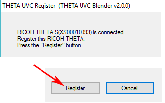
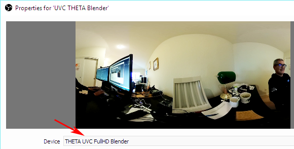
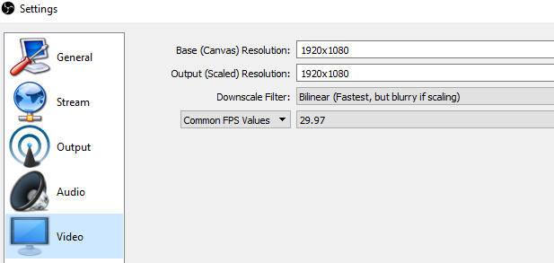

= RICOH THETA Live Streaming
:icons: font
:toc: right
:toclevels: 2
:toc-title: Contents
:sectnums:

++++

++++
image::img/livestreaming/doc-banner.png[role="thumb"]

== Enable Live Streaming Mode
With the THETA off, press and hold the _mode_ button. Keep pressing mode
and then press _power_. The camera will go into live streaming mode.

image::img/livestreaming/mode-buttons.png[role="thumb" title="Start THETA in LiveStreaming mode"]

With the camera in live streaming mode, the word _Live_ will appear in blue.

image::img/livestreaming/live-light.png[role="thumb" title="Verify that the camera's _Live_ light is on"]

== Connect Camera to Computer
Plug the camera into your computer with a micro USB cable. It will appear as a normal
webcam. The camera will be called _RICOH THETA S_.

image::img/livestreaming/skype-webcam.png[role="thumb" title="Confirm you can see _RICOH THETA S_ as a webcam"]

The THETA is now streaming in dual-fisheye mode. The stream is 1280x720 at 15fps.
The data is in MotionJPEG format.

== Install Live Streaming Software
To stream the video to YouTube, install the official
https://theta360.com/en/support/download/[RICOH Live-streaming app] and
https://obsproject.com/[OBS].

NOTE: Many software can be used to stream to YouTube. Refer to
https://support.google.com/youtube/answer/2907883?hl=en[YouTube Live Verified Devices and Software]
for more information.

=== Download and Install RICOH Live-Streaming App

https://theta360.com/en/support/download/[Download]

image::img/livestreaming/live-streaming-download.png[role="thumb" title="Download the RICOH Live-Streaming App"]

1. Select Windows 32bit, Windows 64bit, or Mac
2. Turn your THETA off
3. Unplug THETA from your computer
4. Install software

image::img/livestreaming/uvcblender-install.png[role="thumb" title="Live-Streaming App File is Called UVC Blender"]

With the THETA turned off, the software will prompt you to reconnect the THETA to register your camera.

image::img/livestreaming/register.png[role="thumb" title="Register THETA with computer"]

After you connect your THETA, a _Register_ button will appear.

Complete the registration.

image::img/livestreaming/registration-complete.png[role="thumb" title="Camera and computer registration complete"]

Test the THETA UVC Blender driver with any software that works with a webcam. In the example
below, I am using Skype.

image::img/livestreaming/theta-uvc-skype-select.png[role="thumb" title="Testing THETA UVC Blender with Skype"]

CAUTION: Make sure you select _THETA UVC Blender_ and not _RICOH THETA S_.

NOTE: In Skype, the video does not have 360&#176; navigation (as of Oct 2016) and it will
look like a distorted rectangle. Skype is for testing only, not for use.

=== Download and Install OBS
image::img/livestreaming/obs-icon.png[role="thumb" title="OBS Studio"]

https://obsproject.com/[Download OBS]

Create a new _Scene_. Any name is fine. Click on the plus sign. Under
_Sources_, add THETA UVC Blender (any name is fine) and add
a video capture device. Right click to open the pop-up menu.

image::img/livestreaming/obs-video-capture.png[role="thumb" title="Add Video Capture Device to OBS _Sources_"]

Select _THETA UVC Blender_ as the Device. Verify that the video stream is in equirectangular format.

TIP: If you see a black screen that says _Status:0x800705AA_, try to toggle your device between your two
webcams. If you still see the error, disconnect all other webcams or disable the webcam on your laptop
and then reboot your computer. The error above indicates that a connection is not established. See Troubleshooting
section below

Leave the Resolution/FPS Type as _Device Default_.

image::img/livestreaming/resolution-fps.png[role="thumb" title="Leave Resolution/FPS Type as Default"]

Under Settings -> Video, set the resolution to 1280x720.

NOTE: As of Oct 2016, the maximum resolution for UVC Blender is 720p. It's likely that a higher resolution
driver may be available in the future. Please check the maximum resolution and adjust your settings if needed.

Select Stretch to screen.

image::img/livestreaming/obs-stretch-to-screen.png[role="thumb"]

## Create a YouTube Live 360&#176; Event

Log into YouTube. Click on the _Upload_ button.
Click the _Get started_ button on live streaming.

image::img/livestreaming/youtube-livestream.png[role="thumb" title="Click Live Streaming after you click upload"]

Select _Events_.

image::img/livestreaming/youtube-event.png[role="thumb" title="Select Events"]

WARNING: Make sure you select Events. You will not get a 360&#176; stream with _Stream now_.

In the right side of the screen, select _New live event_.

image::img/livestreaming/youtube-new-live-event.png[role="thumb" title="New live event"]

Add a title.

Select Advanced Settings

image::img/livestreaming/youtube-advanced-settings.png[role="thumb"]

Select _This live stream is 360_.

image::img/livestreaming/youtube-livestream360.png[role="thumb" title="Select _This live stream is 360_"]

Grab stream name from _Ingestion Settings_

image::img/livestreaming/youtube-ingestion-1.png[role="thumb"]

Once you click on _Basic ingestion_ information on your encoder will open up.

image::img/livestreaming/youtube-basic-ingestion.png[role="thumb"]

Copy the stream name. You will need this for OBS. In OBS, it is called, _Stream key_.

image::img/livestreaming/youtube-streamname.png[role="thumb"]

Open OBS, go to Settings -> Stream. Paste the YouTube stream name into the box
on OBS called, _Stream key_.

image::img/livestreaming/obs-streamkey.png[role="thumb"]

On the main OBS front control panel, press _Start Streaming_ in the right hand
side of the control panel.

image::img/livestreaming/obs-start-streaming.png[role="thumb"]

On YouTube, go to the _Live Control Room_ and click _Preview Stream_.

image::img/livestreaming/youtube-preview.png[role="thumb"]

You can preview the stream if you have good bandwidth. I have limited
upstream bandwidth in my office. I reduced the ingestion bandwidth,
making my resolution lower.

image::img/livestreaming/youtube-preview-test.png[role="thumb"]

When you're ready, start the stream.

image::img/livestreaming/youtube-streaming.png[role="thumb"]

## Using HDMI

Using USB output for live streaming, you will get a maximum resolution of 720p.
If you save your video files to your camera, the resolution will be 1920x1080.
If you save still images as timelapse, you can get 5376x2688, which will be displayed
as 4K on YouTube.

The THETA S has an HDMI port that can output 1920x1080 at 30fps. In order to use
this signal, you need to use something like
https://www.blackmagicdesign.com/products/ultrastudiothunderbolt[Blackmagicdesign UltraStudio for Thunderbolt].

Once you get the video stream onto your computer, it will be in dual-fisheye.
To get this into equirectangular, you will need to use a third-party product
such as
http://theta360.guide/showcase/ricoh-product-streambox.html[Streambox Cloud Encoder].

image::img/livestreaming/streambox-theta.png[role="thumb"]

This is the workflow.

image::img/livestreaming/streambox-workflow.png[role="thumb"]

This is a
https://www.youtube.com/watch?v=d8TN_Vc6wL0[sample of the live stream using a THETA].

image::img/livestreaming/streambox-sample.png[role="thumb"]

This is the equipment and service list used:

* Streamed live using Streambox Cloud Encoder
* RICOH THETA S Camera
* BlackMagic UltraStudio Mini Recorder
* MacBook Pro with USB Modems
* Streambox Cloud

http://shop.videostream360.com/vr-cams-equipment/360camera[Videostream360]
advertises using THETA at 1920x1080 with HDMI. They're even selling the
THETA on their site. I am trying to get more information on this deployment.

If you have a solution for HDMI 360&#176; streaming and you've verified that it
works with the THETA, please join the
http://theta360.guide/ecosystem/[THETA Ecosystem] and
http://lists.theta360.guide/c/theta-media/ecosystem-discussion[post]
information about it.

## Using WiFi

Streaming from the THETA using WiFi is primarily of interest to developers
and hobbyists.

### Using Unity

The THETA can live stream a 640x320 MotionJPEG at 10fps over WiFi.
This is intended to preview
a picture prior to taking the picture. It's not intended for headset navigation.
The community has built some solutions to stream this low-res, low fps video
to mobile phones, primarily using Unity.

This is a short Vine video of a
https://vine.co/v/eV9XDQBEujt[demo].

image::img/livestreaming/wifi-unity.png[role="thumb" title="360&#176; video stream using WiFi"]

Here is
https://github.com/theta360developers/ThetaWifiStreaming[sample code]
of the THETA S WiFi streaming demo with Unity.

There's
http://lists.theta360.guide/t/using-ricoh-theta-live-view-with-unity/70?u=codetricity[more information]
on using Unity with the THETA.

=== Using a Raspberry Pi

A Raspberry Pi can take the video live stream from the THETA using USB
and transmit the stream to another device using WiFi. This is intended
for software developers to use as starting point.

There is
https://github.com/theta360developers/video-streaming-sample-app[sample code]
 available for both the transmission of the live stream
and the conversion of the live stream into a navigable 360 video. Both the
browser and the server applications are written in JavaScript. The server application
uses node.

image::img/livestreaming/thetaview-fisheye.png[role="thumb" title="video stream prior to conversion"]

The sample code uses JavaScript to convert the dual-fisheye video stream into
a navigable 360&#176; video. Transmission uses
https://webrtc.org/[WebRTC].

image::img/livestreaming/thetaview-360view.png[role="thumb" title="stream conversion done in browser"]

== FAQ

**Q: What's the Resolution and FPS?**

**A:** Updated Oct 2016.

.Table THETA S Live Streaming
|===
|Type |Format |Camera Mode |Size |Frame Rate| Connection

|Live View
|Equirectangular in MotionJPEG
|Image Only
|640x320
|10fps
|WiFi

|USB Live Streaming of dual-fisheye
|Dual-fisheye in MotionJPEG
|live streaming
|1280x720
|15fps
|USB isochronous transfer

|HDMI live streaming of dual-fisheye
|Dual-fisheye in uncompressed YCbCr
|live streaming
|1920x1080, 1280x720, 720x480
|30fps
|HDMI

|USB live streaming of equirectangular
|Equirectangular in MotionJPEG
|live streaming
|1280x720
|15fps
|USB
|===

---

**Q: Can I stream from a drone to a headset?**

**A:** Only with expensive equipment. This is not a good use of the THETA for
recreational hobbyists.
http://lists.theta360.guide/t/using-theta-360-video-from-a-drone/133?u=codetricity[Refer to this article] for more
information.

---

**Q: Does the THETA have auto-stabilization?**

**A:** No. You'll need to use a third-party
http://lists.theta360.guide/t/theta-s-dokumentation-on-a-clasic-mc-rally/211/11?u=codetricity[gimbal].

---

**Q: Is anyone using the THETA 360&#176; stream for object recognition?**

**A:** Yes. Most people use the raw video from 2 fisheye spheres. Most people do not convert
to equirectangular video. Just extract a portion of the sphere and perform the
image recognition or measurement on that section. The HDMI stream has higher resolution. Most
people are using that and extracting a frame, then performing the calculation. Known applications
include facial recognition, audience emotion recognition, autonomous vehicle operation.
As just one example, the winner of the RICOH prize at the 2016 DeveloperWeek Hackathon used
the
https://www.microsoft.com/cognitive-services/en-us/emotion-api[Microsoft Emotion API] on
the dual-fisheye spheres.

---

**Q: Is anyone working on panoramic sound?**

**A:** Yes. There are many projects for 3D sound, including
http://lists.theta360.guide/t/panoramic-videos-with-panoramic-sounds/304?u=codetricity[SOPA],
an open source JavaScript library.

---

**Q: How do I increase the sound quality?**

**A:** Use an external microphone and add it to your mixer. Set the THETA's input
to zero using your mixer. If you're using OBS for the stream, plug your microphones into your
computer and then add a new audio source from the main dashboard to your stream.
There is no way to plug a microphone directly into the THETA.

image::img/livestreaming/mixer.png[role="thumb" title="OBS mixer"]

== Troubleshooting

=== Streaming to YouTube
==== Problem: Status:0x800705AA

image::img/livestreaming/obs-error.png[role="thumb" title="Error message when device not detected"]

1. Verify your firmware is 01.42 or above
2. Make sure your camera has the blue word `Live` in LED lights on
3. Toggle between webcam and UV Blender. If this still fails to resolve the problem,
disable all other webcams and reboot
4. Try a different USB cable. Plug it into the port on the back of your computer

==== Problem: Screen is black with nothing on it

Check video resolution. Set to 1280x720

==== Problem: Video on YouTube is Equirectangular with No Navigation

If the stream is in equirectangular on OBS and it can't be navigated on YouTube, check
your YouTube configuration.

=== Heat
The unit below overheated 16 minutes into the shoot. It is using UVC Blender and a
USB cable during an indoor shoot at Stanford during a crowded VR event.

image::img/livestreaming/heat/overheat-example.png[role="thumb" title="Overheating during livestream"]

If the THETA is overheating, point a standard household fan at it. The airflow
may be enough to cool the outside of the THETA and help with the internal
overheating.

People have reported success by sticking $6 Raspberry Pi heatsinks onto the body of the THETA or
taping or attaching a small fan used for computer CPUs to the outside of the THETA.

image::img/livestreaming/heat/heatsinks.png[role="thumb" title="Raspberry Pi Heatsinks (L), small computer fan bracket (R)"]

* https://amzn.com/B00LKX618Q[6 piece Addicore heatsink] for Raspberry Pi for $5.95
* https://amzn.com/B01GE7Q060[Mudder 8 piece black heatsink cooler for RPi] for $6.99
* https://www.tinkercad.com/things/7oICypvba1i-theta-s-cooling-fan-holder[TinkerCad Fan Holder for 3D printing]

The enthusiast below created custom cases in plastic through a shop
in Akihabara. He wanted to use metal, but the cost
was too high.

image::img/livestreaming/heat/case-mod.png[role="thumb" title="Not recommended, but an example of community enthusiasm"]

== Discuss

If you have questions, comments or additions, please post them in the
http://lists.theta360.guide/t/new-theta-360-video-live-streaming-guide-available/477?u=codetricity[THETA Unofficial Guide Forum].

If you have a product or service that you've _verified works with the THETA_,
please join the
http://theta360.guide/ecosystem/[THETA Developer Ecosystem]. Once you've joined the ecosystem, you
can post your product information in the
http://lists.theta360.guide/c/theta-media/ecosystem-discussion[Ecosystem Discussion] category.
