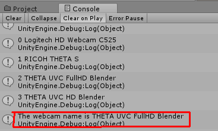
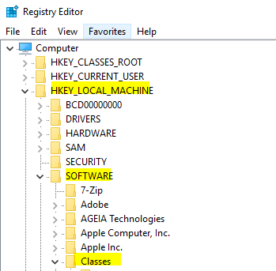
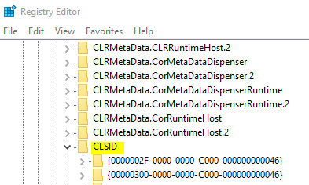
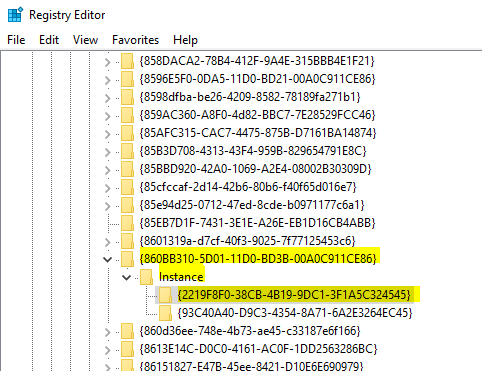
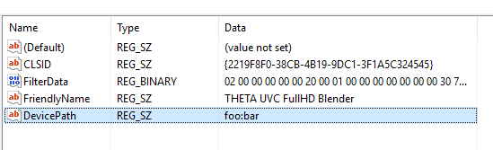

## Tethered Streaming with Unity

image::img/livestreaming/unity/gitai.png[role="thumb" title="GITAI example"]

Example above built by http://gitai.tech/[GITAI].

Technical information below originally found 
http://sekaikigyouka.com/?page_id=846[here] in Japanese.

* Language: HTML/CSS, Javascript, Java, C, C++, C#, PHP
* Database: MySQL
* Library: Three.js, A-Frame
* Tools: Unity
* Network: Photon, Serial, UDP
* PaaS: AWS, Heroku, milkcocoa
* Others: NodeJS, Socket.io, GitHub, Arduino

### THETA V and Unity

The THETA V is easier to work with as it outputs a stitched equirectangular stream
that you can use directly as a webcam texture in Unity. Just drop it onto a sphere.

### THETA S and Unity

There are three techniques to live stream from the THETA S into a Unity application.

1. http://lists.theta360.guide/t/tutorial-live-ricoh-theta-s-dual-fish-eye-for-steamvr-in-unity/938?u=codetricity[SteamVR] with manual stitch adjustment. Uses RICOH THETA S driver.
2. Generic https://github.com/theta360developers/unity-streaming[Unity application] with manual stitch adjustment. Uses RICOH THETA S driver.
3. http://lists.theta360.guide/t/getting-unity-to-recognize-theta-uvc-fullhd-blender-camera/1035[UVC FullHD Blender with registry hack]. Uses THETA UVC FullHD Blender driver.

#### Manual Stitching

Most people start with https://github.com/theta360developers/unity-streaming[this] set of templates and code.
This technique involves using the THETA S webcam driver, not UVC Blender.
It explains how to go from dual-fisheye to a single sphere.

image::img/livestreaming/unity/dual-fish-eye.jpg[role="thumb" title="Dual-fisheye with THETA S driver"]

image::img/livestreaming/unity/results-mesh.png[role="thumb"]

image::img/livestreaming/unity/sphere-unity.png[role="thumb"]

##### Problems
People encounter two problems with the tutorial above.

1. There's only a single camera on half the sphere. (you need to add a second camera)
2. There's a gap in the sphere that requires manual blender (one time only)

image::img/livestreaming/unity/sphere-gap.png[role="thumb" title="Webcam texture will result in gap"]

This note from Megan Zimmerman explains the issue.

""
The dual projection is implied in Hecomi's post as he adds the camera feed
script to both spheres for their equirectangular solution. In
the Tanyuan solution, you have equirectangular already and are projecting
one feed onto one sphere, because we are using two spheres we project onto both.

Personally, when I started working on this solution I got caught up in Hecomi's
solution because its harder to understand what is going on if you don't do it
yourself step by step. This has me thinking that I should probably make my
own shader from scratch, because while I get the idea of what the
shader is doing, I want to understand how.
""

There are different ways to adjust the projection on the sphere to get rid
of the gap. Manual adjustment is common.

  Sphere1:
  Offset U: 0.013
  Offset V: 0.007
  Scale U: 0.983
  Scale V: 1.149
  Scale Center U: 0.0686
  Scale Center V: 0.5

  Sphere2:
  Offset U: -0.01
  Offset V: -0.031
  Scale U: 0.976
  Scale V: 0.958
  Scale Center U: 0.26
  Scale Center V: 0.55

image::img/livestreaming/unity/megan-closed-gap.png[role="thumb" title="manual adjustment to close gap between each lens"]

#### UVC FullHD Blender with Unity

The Ricoh application UVC FullHD Blender will stitch the two spheres on your Windows machine.
Unfortunately, this is not usable within Unity. If you hack the registry, you can
get Unity to recognize THETA UVC FullHD Blender.

Using this technique, you can simply add UVC FullHD Blender as a `WebCamTexture` in Unity. The stitch
will look close to perfect.

image::img/livestreaming/unity/uvc-working.png[role="thumb" title="UVC Blender projected to sphere"]

Here's how to do it.

**Edit Windows Registry**

Open regedit on Windows. You will need to open the folders for *HKEY_LOCAL_MACHINE -> SOFTWARE -> Classes*.

**Open CLSID**

Go to:

    {860BB310-5D01-11d0-BD3B-00A0C911CE86}/Instance

On my computer, THETA UVC FullHD Blender is

    {2219F8F0-38CB-4B19-9DC1-3F1A5C324545}

Here's a summary from
http://alax.info/blog/1433[this] blog post that is the source of the regedit info.

""
The registry key is located under HKLM,
SOFTWARE\Classes\CLSID{860BB310-5D01-11d0-BD3B-00A0C911CE86}\Instance
(note it’s SOFTWARE\Classes\Wow6432Node\CLSID... in 64-bit OS for 32-bit app space),
where every subkey corresponds to a registered device
(find yours there).
Note that CLSID above is actually CLSID_VideoInputDeviceCategory.
""
