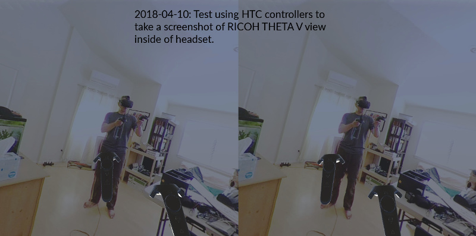
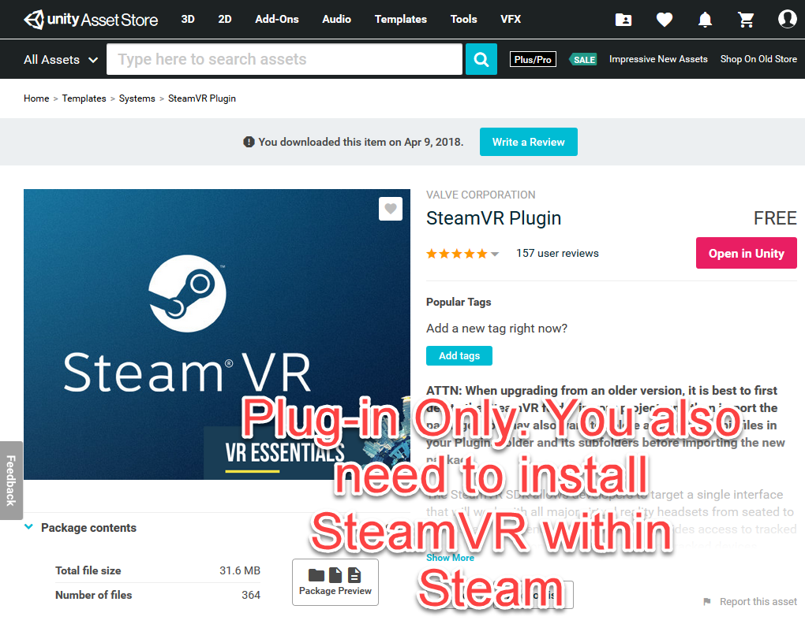
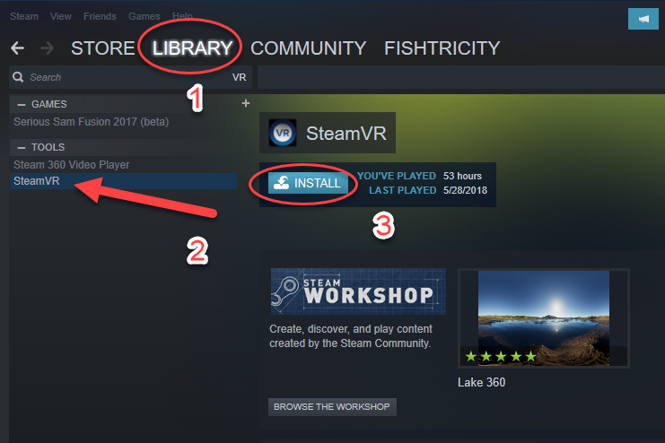
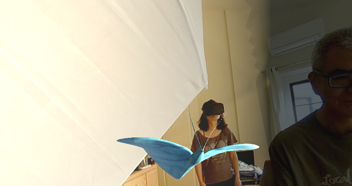
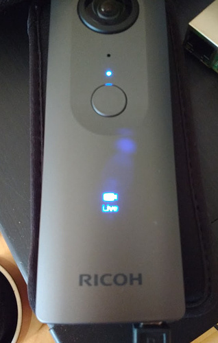
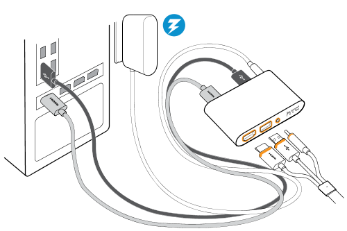
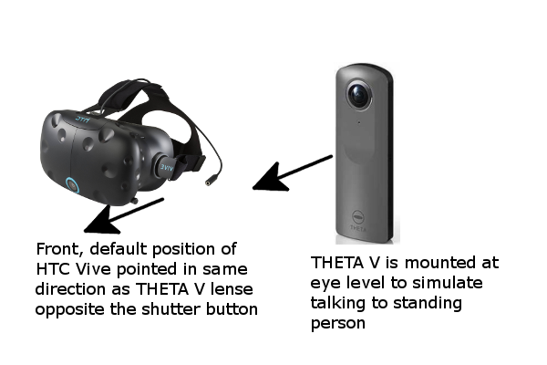
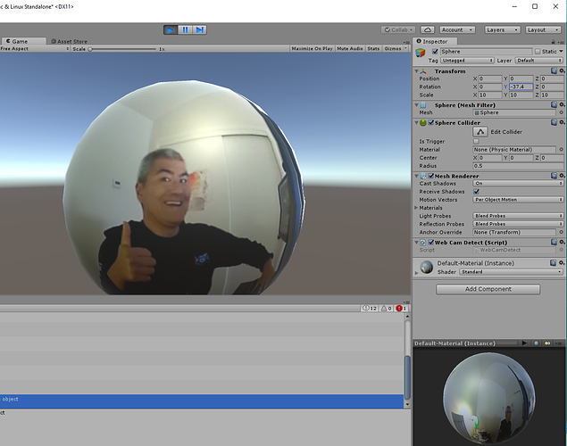

## Tethered Streaming with Unity

image::img/livestreaming/unity/gitai.png[role="thumb" title="GITAI example"]

Example above built by http://gitai.tech/[GITAI].

Technical information on the GITAI example originally found 
http://sekaikigyouka.com/?page_id=846[here] in Japanese.

* Language: HTML/CSS, Javascript, Java, C, C++, C#, PHP
* Database: MySQL
* Library: Three.js, A-Frame
* Tools: Unity
* Network: Photon, Serial, UDP
* PaaS: AWS, Heroku, milkcocoa
* Others: NodeJS, Socket.io, GitHub, Arduino

### THETA V and Unity

The THETA V is easier to work with as it outputs a stitched equirectangular stream
that you can use directly as a webcam texture in Unity. Just drop it onto a sphere.

#### Overview

The RICOH THETA is the world’s most popular 360 camera. The THETA V model was released in late 2017. The “V” outputs a 4K equirectangular video stream with H264 compression 3840×1920/29.97fps as well as a 2K 1920x960/29.97 stream.

You can easily use a Unity webcam texture to wrap the THETA V 4K video stream onto a sphere to provide a telepresence experience for industrial or experiential applications.

This test application illustrates the following techniques:

* identify THETA V camera inside of Unity
* assign THETA V to a texture
* use flip normals on a Blender sphere to display the webcam texture to the inside of the Sphere.   The Blender sphere is imported into Unity
* use negative scale values to solve mirroring problem of objects in sphere appearing in reverse
* display THETA V stream inside of a HTC Vive headset with SteamVR
* track head movements and controller movements with SteamVR
* use THETA V as a microphone and output audio to HTC Vive
* initial configuration tests to orient the headset and the camera to simulate real-world telepresence

These techniques are compiled from the theta360.guide community in the 
https://community.theta360.guide/c/theta-media/unity-development[Unity Development discussion conference]. 

image::img/livestreaming/unity/thetav/vive/gear.jpg[role="thumb" title="THETA V and HTC Vive"]

#### Software Used in This Test

* RICOH THETA V firmware 2.11.1 (or higher)
* RICOH THETA V live streaming driver 1.0.1  64 bit - You NEED 1.0.1 or higher to work with Unity
* Unity 2017.4.0f1 (earlier version should work)
* SteamVR
* https://assetstore.unity.com/packages/templates/systems/steamvr-plugin-32647[SteamVR Plugin for Unity] 

You need to have Steam and SteamVR installed.

#### Using the Developer Package

Developers can download the https://drive.google.com/file/d/1FOLBZ559fSnwzT2KuXN5hqJhhmlGseMn/view?usp=sharing[Unity Package] with all source code and settings

NOTE: The package contains two simple 3D assets in the scene to illustrate how to import a 3D model. There are two basic moths that are stationary in different lighting areas.

image::img/livestreaming/unity/thetav/vive/moth2.png[role="thumb" title="example of 3D asset embedded into THETA V live streaming scene"]

#### Turn on THETA V in Live Streaming Mode

To simulate the perspective a standing person, put the THETA V on a tripod at eye level. Connect the THETA V with a USB cable and put it into live streaming mode.

#### Connect HTC Vive to Your Computer

#### Align Camera and Headset

The HTC Vive default position is pointed in the same direction as the rear THETA V camera lense. The rear lense is the one that is facing away from the shutter button. A person talking directly to the rear lense will appear to be talking to the face of the person wearing the HTC Vive headset.

#### Start SteamVR

image::img/livestreaming/unity/thetav/vive/steamvr.png[role="thumb" title="SteamVR on Windows 10

#### Start Application on Windows

image::img/livestreaming/unity/thetav/vive/clickme.png[role="thumb" title="Double-click on Icon to Start Application "]

#### Wait for App to Load

The app should load in less than 5 seconds. The headset screen will turn black as the headset adjusts to the THETA V input.

#### Success

Congratulations. You've just completed the test. 

image::img/livestreaming/unity/thetav/vive/finshed.png[role="thumb" title="Simple Test Application "]

If you'd like to modify the code, read on.

#### Audio

The script will use the first audio device it finds. Adjust this line in the code to properly identify the THETA V. The script will display the connected microphones to the debug console of Unity.

    public const int THETA_V_AUDIO_NUMBER = 0;   

#### Viewing Inside of Sphere

I am using a flip-normals sphere that I created in blender. This should be included in the package.

If you’re interested in building your own sphere with Blender,
https://youtu.be/56QGJ76YM-s[this] video will give you a step-by-step process.

image::img/livestreaming/unity/thetav/vive/blender.png[role="thumb" title="Creating a Flip-Normals Sphere in Blender "]

#### Mirroring

The flip-normals sphere causing the scene to appear like a mirror image. To correct this problem, I am inverting the sphere with negative scale. -8, -8, -8.

image::img/livestreaming/unity/thetav/vive/negative-scale.png[role="thumb" title="Assigning negative scale to sphere "]

#### Inverted Camera

I needed to rotate the X axis of the SteamVR rig by 180 degrees in order to get it to work.

image::img/livestreaming/unity/thetav/vive/invert.png[role="thumb" title="Inverting camera"]

### THETA S and Unity

There are three techniques to live stream from the THETA S into a Unity application.

1. http://lists.theta360.guide/t/tutorial-live-ricoh-theta-s-dual-fish-eye-for-steamvr-in-unity/938?u=codetricity[SteamVR] with manual stitch adjustment. Uses RICOH THETA S driver.
2. Generic https://github.com/theta360developers/unity-streaming[Unity application] with manual stitch adjustment. Uses RICOH THETA S driver.
3. http://lists.theta360.guide/t/getting-unity-to-recognize-theta-uvc-fullhd-blender-camera/1035[UVC FullHD Blender with registry hack]. Uses THETA UVC FullHD Blender driver.

#### Manual Stitching

Most people start with https://github.com/theta360developers/unity-streaming[this] set of templates and code.
This technique involves using the THETA S webcam driver, not UVC Blender.
It explains how to go from dual-fisheye to a single sphere.

image::img/livestreaming/unity/dual-fish-eye.jpg[role="thumb" title="Dual-fisheye with THETA S driver"]

image::img/livestreaming/unity/results-mesh.png[role="thumb"]

image::img/livestreaming/unity/sphere-unity.png[role="thumb"]

##### Problems
People encounter two problems with the tutorial above.

1. There's only a single camera on half the sphere. (you need to add a second camera)
2. There's a gap in the sphere that requires manual blender (one time only)

image::img/livestreaming/unity/sphere-gap.png[role="thumb" title="Webcam texture will result in gap"]

This note from Megan Zimmerman explains the issue.

""
The dual projection is implied in Hecomi's post as he adds the camera feed
script to both spheres for their equirectangular solution. In
the Tanyuan solution, you have equirectangular already and are projecting
one feed onto one sphere, because we are using two spheres we project onto both.

Personally, when I started working on this solution I got caught up in Hecomi's
solution because its harder to understand what is going on if you don't do it
yourself step by step. This has me thinking that I should probably make my
own shader from scratch, because while I get the idea of what the
shader is doing, I want to understand how.
""

There are different ways to adjust the projection on the sphere to get rid
of the gap. Manual adjustment is common.

  Sphere1:
  Offset U: 0.013
  Offset V: 0.007
  Scale U: 0.983
  Scale V: 1.149
  Scale Center U: 0.0686
  Scale Center V: 0.5

  Sphere2:
  Offset U: -0.01
  Offset V: -0.031
  Scale U: 0.976
  Scale V: 0.958
  Scale Center U: 0.26
  Scale Center V: 0.55

image::img/livestreaming/unity/megan-closed-gap.png[role="thumb" title="manual adjustment to close gap between each lens"]

#### UVC FullHD Blender with Unity

The Ricoh application UVC FullHD Blender will stitch the two spheres on your Windows machine.
Unfortunately, this is not usable within Unity. If you hack the registry, you can
get Unity to recognize THETA UVC FullHD Blender.

image::img/livestreaming/unity/uvc-blender-unity.png[role="thumb" title="UVC Blender recognized by Unity as a webcam"]

Using this technique, you can simply add UVC FullHD Blender as a `WebCamTexture` in Unity. The stitch
will look close to perfect.

Here's how to do it.

**Edit Windows Registry**

Open regedit on Windows. You will need to open the folders for *HKEY_LOCAL_MACHINE -> SOFTWARE -> Classes*.

image::img/livestreaming/unity/regedit_classes.png[role="thumb"]

**Open CLSID**

image::img/livestreaming/unity/regedit_clsid.png[role="thumb"]

Go to:

    {860BB310-5D01-11d0-BD3B-00A0C911CE86}/Instance

image::img/livestreaming/unity/regedit_instance.png[role="thumb"]

On my computer, THETA UVC FullHD Blender is

    {2219F8F0-38CB-4B19-9DC1-3F1A5C324545}

image::img/livestreaming/unity/device_path.png[role="thumb"]

Here's a summary from
http://alax.info/blog/1433[this] blog post that is the source of the regedit info.

""
The registry key is located under HKLM,
SOFTWARE\Classes\CLSID{860BB310-5D01-11d0-BD3B-00A0C911CE86}\Instance
(note it’s SOFTWARE\Classes\Wow6432Node\CLSID... in 64-bit OS for 32-bit app space),
where every subkey corresponds to a registered device
(find yours there).
Note that CLSID above is actually CLSID_VideoInputDeviceCategory.
""
