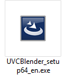
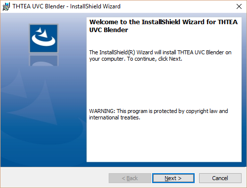

=== RICOH Live Streaming Driver (UVC THETA) with Equirectangular Output

image::img/livestreaming/streaming.jpg[role="thumb" title="USB live streaming with equirectangular"]

The USB driver appears as a web cam to applications running a Mac or PC.
In the example above, the equirectangular video is shown streaming in
QuickTime. A video clip
that shows the output of the
https://youtu.be/A8Al7U2ZeF0?list=PLxvyAnoL-vu5AF0A_l2wIr9vkMBRjHEgm[THETA S USB live streaming is available on YouTube].

You must install the live streaming driver, UVC THETA. Download it from

https://theta360.com/en/support/download/

image::img/livestreaming/driver-download.png[role="thumb" title="Download the official RICOH live streaming driver"]

This walkthrough is for Windows 10 64 bit.

Right click on the UVCBlender_setup64_en.exe icon. Run as administrator

image::img/livestreaming/setup-run-as-admin.png[role="thumb" title="Make sure you run it as administrator"]

Run through the install wizard.

image::img/livestreaming/install-shield-complete.png[role="thumb" title="InstallShield Wizard Completes"]

After installation, you will need to connect a THETA that is powered off to register
the device. You may need to reboot. In my tests, I could not advance to the
UVC register step without a reboot. If I try and register the device without
rebooting, I see a flashing _Establishing a Connection_ dialog, but the connection
is never completed.

image::img/livestreaming/register.png[role="thumb" title="THETA UVC Register"]

If you need to reboot, run the THETA UVC Register application as administrator.

image::img/livestreaming/theta-uvc-register.png[role="thumb" title="Run THETA UVC Register as administrator"]

After a reboot and starting THETA UVC Register as administrator, I then plug the THETA
in. The THETA is turned off. The connection is established.

image::img/livestreaming/register-button.png[role="thumb" title="If you don't see the register button, go back a few steps"]

The registration completes.

image::img/livestreaming/registration-complete.png[role="thumb" title="Make sure the registration is successful"]

At this stage, you may need to reboot again. If you do, it is a one-time requirement.

Now, press power and mode to start the THETA S in live streaming mode. Test it
with a common video streaming application such as Google Hangout. I have heard
of people having problems displaying the stream. Start your application first with
the camera unplugged. Once the application is running, select THETA UVC Blender,
then start your THETA in live streaming mode, and plug it in. There are
probably other ways to get the application to recognize the live stream, but this
sequence consistently works for me.

image::img/livestreaming/hangout.png[role="thumb" title="Test with Google Hangout"]

Go into the settings of Google Hangout to select the THETA UVC Blender webcam.

image::img/livestreaming/select-uvc-blender.png[role="thumb" title="Select THETA UVC Blender, not THETA S"]

image::img/livestreaming/uvc-blender-selected.png[role="thumb" title="video should be in equirectangular"]

image::img/livestreaming/google-hangout-in-use.png[role="thumb" title="THETA S in use as webcam"]

Here's an example with
https://obsproject.com/[Open Broadcaster Software].

Create a new Scene called _THETA Test_. Right click in _Sources_ to _Add_ a
new _Video Capture Device_

image::img/livestreaming/obs-video-capture.png[role="thumb" title="Add THETA S as Video Capture Device to OBS"]

Under the _Device Selection_ window, select _THETA UVC Blender_. Click _OK_.

image::img/livestreaming/obs-video-device-selection.png[role="thumb" title="Select THETA UVC Blender as Device"]

The video stream will fill a portion of the screen. Select _Edit Scene_ to size the video stream to fit.

image::img/livestreaming/obs-base.png[role="thumb" title="Edit Scene to Fit the Stream"]

image::img/livestreaming/obs.png[role="thumb" title="Live Streaming with Open Broadcaster Software"]

Ideally, I would like to test the output to a streaming server like the one shown below.

image::img/livestreaming/streamer2.png[role="thumb" title="streaming concept"]

I don't have access to something like LiveShell or VidiU Teradek. I'm also now sure
how the navigation of the video would work.

Refer to the RICOH THETA S Unofficial Guides for more information.

http://theta360.guide/

++++

++++
